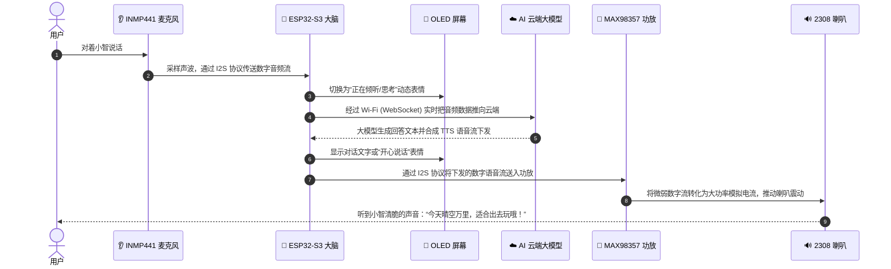

# 第 01 章：认识小智 AI 的“人体器官”与工具上手

如果你第一次打开一块绿色的电路板（PCB），上面密密麻麻的金属线和黑色芯片可能会让你头晕。  
**别怕！** 我们换个视角：**把小智 AI 当作一个活生生的小机器人，它身上也有像人一样的器官！**

---

## 🤖 1. 小智 AI 的人体器官对照表

```plaintext
┌──────────────┬────────────────────────┬──────────────────────────────────────────┐
│  人体器官    │    小智 AI 对应硬件    │                 它的核心工作             │
├──────────────┼────────────────────────┼──────────────────────────────────────────┤
│ 🧠 大脑中枢   │ ESP32-S3 核心开发板    │ 连 Wi-Fi，把声音传给云端 AI 大模型并思考 │
│ 👂 耳朵听觉   │ INMP441 全向麦克风     │ 捕捉你说话的声音，变成数字信号传给大脑   │
│ 👄 嘴巴发声   │ MAX98357A 功放 + 喇叭  │ 把 AI 回答的数字声音放大，通过喇叭念出来 │
│ 👀 眼睛表情   │ 0.91 寸 OLED 屏幕      │ 显示眨眼、高兴、思考表情，以及网络状态   │
│ 🩸 血液与心脏 │ 锂电池充放电板 + 开关  │ 提供源源不断的 5V / 3.3V 能量血液        │
│ 🦴 骨骼与神经 │ PCB 绿板 + 铜皮走线    │ 固定所有器官，通过铜线传递神经电信号     │
└──────────────┴────────────────────────┴──────────────────────────────────────────┘
```

---

## 🔄 2. 小智和你聊一次天的完整生命旅程

想象一下你对小智说了一句：“*小智，今天天气怎么样？*”



---

## 💻 3. 嘉立创EDA专业版环境上手与实操技巧

### (1) 打开工程
1. 启动 **嘉立创EDA (专业版)** 客户端。
2. 点击菜单 **文件 -> 打开工程**。
3. 浏览并选中本仓库中的文件：  
   `d:\code\sanbox\esp32-pcb-journey\hardware\01-xiaozhi-ai\ProPrj_AI-xiaozhi.epro`

---

### (2) 工程师必备高频快捷键速查表

| 模式 | 快捷键 | 功能名称 | 用途说明 |
| :--- | :---: | :--- | :--- |
| **原理图** | `W` | 绘制导线 (Wire) | 连接两个元器件引脚（变成实体绿线） |
| **原理图** | `N` | 放置网络标签 (Net Label) | 贴上相同名字实现“隔空连通”，避免连线杂乱 |
| **原理图** | `Shift + F` / `S` | 器件库搜索 (Search) | 调出立创商城海量官方元器件库一键调用 |
| **原理图** | **`Space` (空格)** / `R` | **旋转元器件 90°** | 调整器件横竖方向，消除导线交叉 |
| **原理图** | `X` | 水平镜像翻转 | 将元器件左右引脚对调镜像 |
| **原理图** | `Y` | 垂直镜像翻转 | 将元器件上下引脚对调镜像 |
| **PCB** | `W` | 开始布线 (Route Track) | 把虚线飞线画成实体铜线 |
| **PCB** | `V` | 放置过孔 (Via) | 打通顶层和底层（立体走线换层立交桥） |
| **PCB** | `B` | 重建铺铜 (Rebuild Copper)| 重新计算并铺满整板 GND 铜皮保护伞 |
| **PCB** | `Alt + 3` | 3D 视图预览 (3D View) | 360° 无死角查看立体板卡实物装配效果 |

---

### (3) ❓ 新手常见疑问与避坑排查

#### Q1: 为什么我按快捷键（如 W, Space, R）没反应？
1. ⚠️ **最常见原因：当前处于【中文输入法】状态！**  
   按一下键盘 `Shift` 键切换为 **【纯英文状态】**，EDA 才能接收到字母快捷键。
2. **画布没有获取焦点**：用鼠标在中间原理图空白处单击一下，重新激活画布。
3. **旋转按键的使用前提**：鼠标必须正在**抓着/拖动**元器件，或者先**单击选中**该元器件（出现高亮框），按空格才会原地旋转。

#### Q2: 按空格键（Space）究竟是在干嘛？
- **核心作用**：将当前元器件顺时针/逆时针 **旋转 90 度**。
- **为什么要旋转？**：
  - 例如电阻默认是水平横放的，按一下空格变成竖放，接在上下引脚之间就是一条笔直的直线；
  - 调整芯片引脚朝向，让两个互连引脚面对面，避免导线绕大圈打结。

#### Q3: 如何在原理图上新放置或新建一个组件？
1. **直接调用库（95% 场景首选）**：
   - 按 `Shift + F` 打开器件库，搜索型号（如 `ME6211`）或立创编号（如 `C82942`）；
   - 点击右下角 **【放置】** 即可将器件直接放到原理图上。
2. **从零手动画全新组件（小众器件）**：
   - **新建符号 (Symbol)**：菜单 `文件 -> 新建 -> 符号`，画外框并放置引脚（注意引脚连接端小白点朝外）；
   - **新建封装 (Footprint)**：菜单 `文件 -> 新建 -> 封装`，放置物理焊盘并画丝印框；
   - **新建器件 (Device)**：菜单 `文件 -> 新建 -> 器件`，将符号和封装引脚一一绑定映射。

---

## 🎯 总结与下一章铺垫

现在你已经掌握了小智 AI 的全身器官、EDA 核心操作与方向旋转技巧。  
接下来我们进入基础篇：看看图纸上的符号、电压和电阻电容到底是干什么的！

👉 [前往 第 02 章：电路小白的第一堂课——原理图里的基本符号与电路规律](02-schematic-and-circuit-intuition.md)
