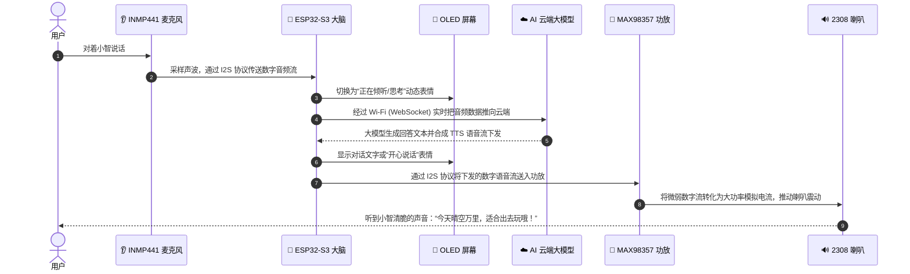

# 第 01 章：认识小智 AI 的“人体器官”与工具上手

如果你第一次打开一块绿色的电路板（PCB），上面密密麻麻的金属线和黑色芯片可能会让你头晕。  
**别怕！** 我们换个视角：**把小智 AI 当作一个活生生的小机器人，它身上也有像人一样的器官！**

---

## 🤖 1. 小智 AI 的人体器官对照表

```plaintext
┌──────────────┬────────────────────────┬──────────────────────────────────────────┐
│  人体器官    │    小智 AI 对应硬件    │                 它的核心工作             │
├──────────────┼────────────────────────┼──────────────────────────────────────────┤
│ 🧠 大脑中枢   │ ESP32-S3 核心开发板    │ 连 Wi-Fi，把声音传给云端 AI 大模型并思考 │
│ 👂 耳朵听觉   │ INMP441 全向麦克风     │ 捕捉你说话的声音，变成数字信号传给大脑   │
│ 👄 嘴巴发声   │ MAX98357A 功放 + 喇叭  │ 把 AI 回答的数字声音放大，通过喇叭念出来 │
│ 👀 眼睛表情   │ 0.91 寸 OLED 屏幕      │ 显示眨眼、高兴、思考表情，以及网络状态   │
│ 🩸 血液与心脏 │ 锂电池充放电板 + 开关  │ 提供源源不断的 5V / 3.3V 能量血液        │
│ 🦴 骨骼与神经 │ PCB 绿板 + 铜皮走线    │ 固定所有器官，通过铜线传递神经电信号     │
└──────────────┴────────────────────────┴──────────────────────────────────────────┘
```

---

## 🔄 2. 小智和你聊一次天的完整生命旅程

想象一下你对小智说了一句：“*小智，今天天气怎么样？*”



---

## 💻 3. 嘉立创EDA专业版环境上手与常用快捷键

### (1) 打开工程
1. 启动 **嘉立创EDA (专业版)** 客户端。
2. 点击菜单 **文件 -> 打开工程**。
3. 浏览并选中本仓库中的文件：  
   `d:\code\sanbox\esp32-pcb-journey\hardware\01-xiaozhi-ai\ProPrj_AI-xiaozhi.epro`

### (2) 工程师必备高频快捷键速查表

| 模式 | 快捷键 | 功能名称 | 用途说明 |
| :--- | :---: | :--- | :--- |
| **原理图** | `W` | 绘制导线 (Wire) | 连接两个元器件引脚 |
| **原理图** | `N` | 放置网络标签 (Net Label) | 贴上相同名字实现“隔空连通” |
| **原理图** | `Shift + F` | 器件库搜索 (Search) | 调出立创商城海量官方元器件库 |
| **原理图** | `R` / `Space` | 旋转元器件 (Rotate) | 90° 旋转元器件方向 |
| **PCB** | `W` | 开始布线 (Route Track) | 把虚线飞线画成实体铜线 |
| **PCB** | `V` | 放置过孔 (Via) | 打通顶层和底层（立体走线换层） |
| **PCB** | `B` | 重建铺铜 (Rebuild Copper)| 重新计算并铺满整板 GND 铜皮 |
| **PCB** | `Alt + 3` | 3D 视图预览 (3D View) | 360° 无死角查看立体板卡实物效果 |

---

## 🎯 总结与下一章铺垫

现在你已经对小智 AI 的整体运作有了宏观的“全局地图”，并掌握了 EDA 软件的核心快捷键。  
接下来我们进入基础篇：看看图纸上的符号、电压和电阻电容到底是干什么的！

👉 [前往 第 02 章：电路小白的第一堂课——原理图里的基本符号与电路规律](02-schematic-and-circuit-intuition.md)
