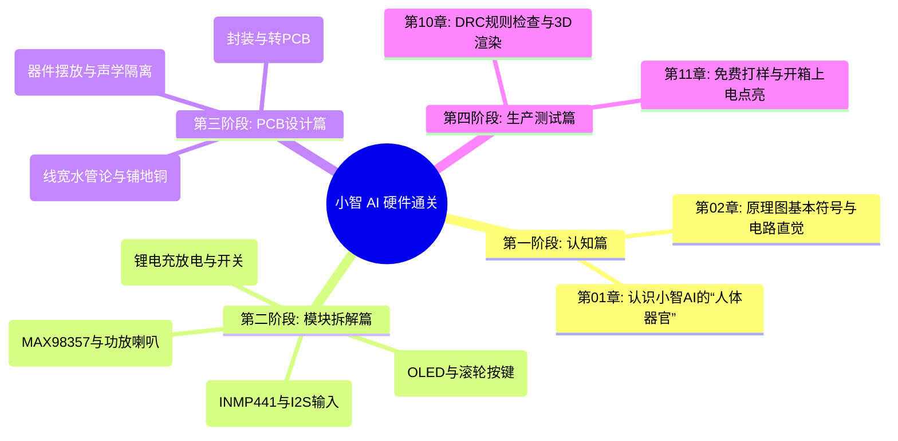

# 📖 小智 AI 硬件设计与嘉立创EDA零基础通关宝典

> **写在前面**：无论你之前有没有学过电子电路，只要你会用电脑，本教程就会用最通俗的生活化比喻、丰富的图解和手把手的步骤，带你从零看懂、亲手复刻并打样出属于你自己的 **小智 AI 聊天机器人硬件底板**！

---

## 🗺️ 课程大纲全览 (Syllabus)

---

## 📚 教程章节目录与阅读顺序

| 阶段 | 章节 | 核心主题 | 生活化通俗比喻 | 状态 |
| :--- | :--- | :--- | :--- | :---: |
| **阶段一：认知篇** | [**第 01 章：认识小智 AI 的“人体器官”**](01-xiaozhi-anatomy.md) | 拆解大脑、耳朵、嘴巴、眼睛与血液循环 | 像看人体结构一样看电路板 | 🟢 已发布 |
| | [**第 02 章：电路小白的第一堂课**](02-schematic-and-circuit-intuition.md) | 电压、电流、电阻、电容与网络标签 | 水压、水流、大水缸与隔空传音 | 🟢 已发布 |
| **阶段二：模块拆解** | [**第 03 章：耳朵系统——INMP441 与 I2S 录音**](03-ears-inmp441-i2s-microphone.md) | 模拟声转数字、I2S 协议传送带 | 节拍器与传送带运送数字声音 | 🟢 已发布 |
| | [**第 04 章：嘴巴系统——MAX98357 功放与喇叭**](04-mouth-max98357-amplifier-speaker.md) | D 类音频功放、差分输出驱动喇叭 | 小水管推不动大水车与声音放大 | 🟢 已发布 |
| | [**第 05 章：眼睛与交互——OLED 屏与拨轮按键**](05-eyes-oled-display-and-switch.md) | I2C 串行总线、微型屏幕与按键输入 | 两人对讲机与按键防抖动 | 🟢 已发布 |
| | [**第 06 章：能量之源——锂电池充放电与开关**](06-power-battery-charging-management.md) | 升压降压、充放电保护、侧拨开关 | 稳压水塔与电量大坝安全阀 | 🟢 已发布 |
| **阶段三：PCB 设计** | [**第 07 章：从图纸到现实——封装与飞线**](07-footprint-and-ratsnest-netlist.md) | 物理焊盘、立创商城编号、飞线传递 | 鞋码与脚、未走通的虚线快递路 | 🟢 已发布 |
| | [**第 08 章：布局艺术——小智 AI 器件怎么摆？**](08-layout-rules-and-acoustic-isolation.md) | 布局三铁律、麦克风与喇叭声学隔离 | 房间家具摆放与防止回音啸叫 | 🟢 已发布 |
| | [**第 09 章：布线实战——线宽、过孔与铺地铜**](09-routing-track-width-via-copper-pour.md) | 水管粗细论、立体打洞过孔、地铜保护伞 | 走线不拐直角与全板地铜大合唱 | 🟢 已发布 |
| **阶段四：生产测试** | [**第 10 章：出厂体检——DRC 规则与 3D 渲染**](10-drc-inspection-and-3d-render.md) | 消除短路断路、嘉立创工艺参数、3D 查看 | 板厂的规矩与真机三维试装 | 🟢 已发布 |
| | [**第 11 章：投产与测试——免费打样与上电点灯**](11-ordering-bringup-and-first-talk.md) | Gerber 文件、白嫖打样券、万用表防短路 | 收到板子先量压，开机对话！ | 🟢 已发布 |

---

## 🎯 学习方法建议

1. **左手开教程，右手开嘉立创EDA**：
   - 打开工程文件 [`ProPrj_AI-xiaozhi.epro`](file:///d:/code/sanbox/esp32-pcb-journey/jlceda/hardware/01-xiaozhi-ai/ProPrj_AI-xiaozhi.epro)。
2. **带着问题看**：每读完一章，就在嘉立创EDA的原理图或 PCB 视图中找到对应的器件和走线，亲眼看一看它是怎么连的。
