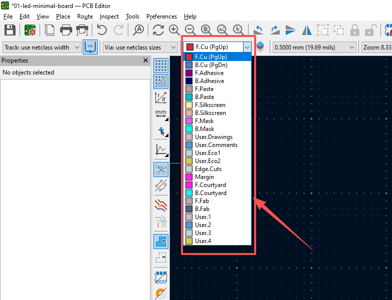
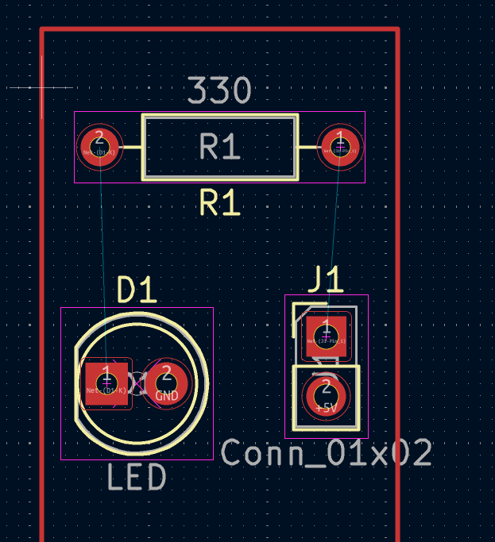

# 第 01 章：KiCad 从这里开始——用一块 LED 最小板跑通全流程

欢迎来到 **KiCad 路线**的第一课！

如果你看到别人「用 AI 帮自己画出了一块 PCB」很心动，但连 KiCad 都没打开过，这一章就是为你准备的。我们的目标非常明确：**在最短时间内，亲手从零画出一块能点亮的 LED 最小板，跑通 KiCad 的完整流程。**

---

## 🛠️ 1. 用一句话搞懂 KiCad 和它为什么特别

**KiCad 就是一款免费开源的「画电路板」软件**：先画电路连接图（原理图），再把它变成真正能打样的电路板（PCB）。

它和嘉立创 EDA 干的其实是同一件事，但 KiCad 有一个「杀手级」的不同点——**它的工程文件是纯文本**：

```plaintext
┌─────────────────────────────────────────────────────────────────┐
│              一个 KiCad 工程（文件夹）里到底有什么？             │
│                                                                 │
│  my-led-board/                                                  │
│  ├── my-led-board.kicad_pro   ← 工程配置（记录库、规则）        │
│  ├── my-led-board.kicad_sch   ← 原理图（纯文本 S 表达式）       │
│  └── my-led-board.kicad_pcb   ← PCB 板子（纯文本 S 表达式）      │
│                                                                 │
│  打开 .kicad_sch / .kicad_pcb，里面是一行行类似代码的文字，       │
│  而不是一堆看不懂的二进制。这就是 AI 能「读、写、改」它们的原因！ │
└─────────────────────────────────────────────────────────────────┘
```

> 💡 **这就是本路线存在的理由**：因为文件是纯文本 + 有官方 Python 接口，所以后面你可以让 Codex / Claude 像改代码一样帮你布局、布线、改板。但前提是——**你得先亲手跑通一遍，才知道该让 AI 帮你干什么。**

---

## 🔌 2. 第一块板子：LED 最小板长什么样？

先别急着打开软件，我们先用 30 秒看懂今天要画的东西。

一个 LED 要能亮起来，只需要「电源 + 限流电阻 + LED」三样东西串成一条回路：

```plaintext
        排针 J1               电阻 R1           发光二极管 D1
      ┌─────────┐           ┌─────────┐        ┌─────────┐
      │ 1  VCC  │─────┐     │         │        │   ▲     │
      │         │     └────►│  330Ω   │───────►│  (发光)  │
      │ 2  GND  │◄──────────┴─────────┴────────│   │     │
      └─────────┘                                └───┬─────┘
                                                     │
        （电流从 VCC 出发 → 经过电阻限流 → 点亮 LED → 回到 GND）

   为什么要加电阻？ 电阻像「水龙头」，把电流限制在安全范围，
   否则电流太大会直接把 LED 烧坏（哪怕只有 5V）。
```

**物料清单（BOM）——今天只用 3 个器件：**

| 位号 | 器件 | 作用 | 推荐封装（新手好焊） |
| :--- | :--- | :--- | :--- |
| `J1` | 2 脚排针 | 接外部 5V/3.3V 电源 | `PinHeader_1x02_P2.54mm_Vertical` |
| `R1` | 电阻 330Ω | 限流，保护 LED | `Resistor_THT` 库里的 `R_Axial_DIN0207`（轴向通孔） |
| `D1` | 红色 LED 5mm | 发光 | `LED_THT` 库里的 `LED_D5.0mm` |

> 全用通孔（插针脚焊背面）器件，是因为它最好手工焊。等熟练了，再换 0603 贴片也不迟。

---

## 💻 3. 安装与界面初识

1. 去官网下载 KiCad 8：<https://www.kicad.org/download/windows/>
2. 一路「下一步」装好，打开 **KiCad（项目管理器）**，你会看到主界面列出了它包含的一堆工具，我们只用得上其中的两个：
   - **原理图编辑器（Schematic Editor）** → 对应 `.kicad_sch`
   - **PCB 编辑器（PCB Editor）** → 对应 `.kicad_pcb`

> ⚠️ 第一次打开某编辑器时，KiCad 可能弹窗问你「是否复制默认库」。**直接选第一项「Copy default global ... (recommended)」**，否则库里会空空的搜不到器件符号。

---

## 🧭 4. 完整流程七步走（今天的主线）

记住这个顺序，KiCad 和嘉立创 EDA 都是这条主线：

```
1 建工程 → 2 画原理图 → 3 分配封装 → 4 电气检查 → 5 转到PCB → 6 布线 → 7 检查+导出Gerber
```

### 步骤 1：新建工程

1. 在主界面点 **文件 → 新建工程**，建一个空文件夹 `01-led-minimal-board`，工程名也叫 `01-led-minimal-board`。
2. 左侧工程树里会出现两个文件：`.kicad_sch`（原理图）和 `.kicad_pcb`（PCB）。
3. 双击 `.kicad_sch` 打开**原理图编辑器**。

### 步骤 2：画原理图（放符号 + 连线）

这一步做两件事：**放器件** + **连导线**。

**(1) 放置三个符号**：按 `A` 打开「选择符号」对话框，在搜索框里输入库里的名字把三个符号拖到图纸上：

| 搜索关键词 | 符号名 | 想成 |
| :--- | :--- | :--- |
| `Conn_01x02` | Connector 库的排针 | 电源输入口 |
| `R` | Device 库的电阻 | 限流电阻 |
| `LED` | Device 库的发光二极管 | 指示灯 |

放好后，选中符号按 `R` 可以旋转角度，摆成一条直线方便连线。

**(2) 放电源符号**：点击右侧工具栏的 **Add Power**（电源符号）按钮，搜 `+5V`（或 `VCC`、`+3V3`）放一个正电源，搜 `GND` 放两个地。

**(3) 连线**：按 `W`（或点击右侧 Wire 工具），把回路接成下面这样：

```plaintext
          +5V
           │
          ┌┴┐
          │J1│  (排针 1 脚接 +5V)
          └┬┘
           │
          ┌┴┐
          │R1│  (电阻 330Ω)
          └┬┘
           │
          ┌┴┐
          │D1│  (LED，注意方向：三角尖端朝 GND)
          └┬┘
           │
          GND
```

**(4) 改值**：选中电阻按 `V` 把值改成 `330`；LED 的值改成 `LED`（或直接留默认）。

> 🔑 **网格避坑**：KiCad 原理图默认网格是 50mil（=1.27mm）。**不要随意把网格改小**，否则导线的端点对不上符号引脚，线路看起来接上了、其实 ERC 会报「未连接」。这是新手最容易踩的坑。

### 步骤 3：分配封装（给每个符号配「鞋子」）

原理图只是「逻辑怎么连」，PCB 需要知道每个器件**实物长什么样**（封装 = 鞋子）。

1. 选中排针 `J1`，按 `F`（编辑封装字段）。点击右侧图标打开「封装浏览器」。
2. 搜索并选中对应封装（见前面的 BOM 表）：
   - `J1` → `PinHeader_1x02_P2.54mm_Vertical`
   - `R1` → 搜 `R_Axial_DIN0207` 里挑一个通孔轴向封装
   - `D1` → 搜 `LED_D5.0mm`
3. 点确定，回到原理图。全部三个符号都这样配好。

### 步骤 4：电气规则检查（ERC）

点顶部 **检查 → 电气规则检查（ERC）**，跑一遍。如果有「未连接引脚」或「引脚重叠」错误，回到步骤 2 检查导线端点是否真的连到引脚上。

> 目标：**0 错误、0 警告（或仅可忽略的警告）**再往下走。

### 步骤 5：把图「搬」到 PCB 上

1. 在原理图编辑器顶部点 **工具 → 更新 PCB 到原理图**（或直接快捷键 `F8`）。
2. 对话框点「更新 PCB」，会看到三个器件 + 一堆浅色橡皮筋线（飞线）出现在 PCB 里。
3. PCB 编辑器会自动打开。满屏乱成一团是正常的。

> 🔑 **先画板框，再摆器件**：
> 1. **怎么切到 `Edge.Cuts`（边框层）**：
>    看顶部工具栏的图层选择下拉框（或右侧「外观 / 图层」面板），在列表中找到并选中 **`Edge.Cuts`**（黄色图标项）。
>
>    
>
>    > ⚠️ **注意线条颜色**：画出的矩形线条必须是**黄色细线**；如果是红线，说明误画在 `F.Cu` 顶层铜箔上了，板厂会把它当成铜线而不是外形切割线！
>
> 2. 用「画矩形」工具（快捷键 `Ctrl+Shift+R`）沿器件周围画一个封闭板框（比如 30mm × 15mm）。
> 3. 把三个器件拖进板框内摆整齐——按 `R` 旋转角度，器件朝向让飞线尽量短、不交叉。

<details>
<summary><b>📚 点击展开：KiCad 图层清单全解（每个层是干嘛的？）</b></summary>

KiCad 里的图层就像**千层饼**或一张张叠在一起的透明菲林胶片。图层前缀缩写：**`F.` = Front（正面/顶层）**，**`B.` = Back（反面/底层）**。

| 图层类别 | 图层名称 | 作用与含义 | 是否出厂制造 |
| :--- | :--- | :--- | :---: |
| **物理轮廓** | **`Edge.Cuts`** | **板框切割线**（数控铣刀沿此线切割 PCB 外形，必选！） | ✅ 必选 |
| **物理轮廓** | `Margin` | 边缘安全间距警戒线（通常空置不用） | ❌ 仅设计 |
| **导电铜皮** | **`F.Cu` / `B.Cu`** | **顶层 / 底层铜箔走线**（真正通电的铜线，红/绿） | ✅ 必选 |
| **阻焊层** | **`F.Mask` / `B.Mask`** | **防焊绿油开窗**（有图案的地方不盖绿油，露出铜皮供焊接） | ✅ 必选 |
| **丝印层** | **`F.Silkscreen` / `B.Silkscreen`** | **字符标识**（板子表面的白色文字、元器件位号 R1/D1/引脚说明） | ✅ 常用 |
| **锡膏钢网** | `F.Paste` / `B.Paste` | 贴片钢网开孔层（工厂用刮刀刷锡膏时漏锡用，手工焊不用） | 🏭 SMT贴片 |
| **红胶层** | `F.Adhesive` / `B.Adhesive` | 波峰焊点胶固定贴片件用（现代回流焊极少用到） | 🏭 生产用 |
| **防撞安全** | `F.Courtyard` / `B.Courtyard` | 元件物理占地防撞框（防止两个元器件靠太近挤压，仅在电脑显示） | ❌ 仅设计 |
| **装配图纸** | `F.Fab` / `B.Fab` | 元件真实比例装配尺寸（供生产装配图纸、3D 预览使用） | ❌ 仅设计 |
| **用户辅助** | `User.Drawings` / `User.Comments` / `User.Eco` | 设计师私人草稿层（标注尺寸尺寸线、留开发备忘笔记） | ❌ 仅设计 |

> 💡 **极简记忆法**：新手画 2 层双面板，只需要关注 **`Edge.Cuts`（板框）**、**`F.Cu`/`B.Cu`（走线）**、**`F.Silkscreen`（写白字）** 三个层！
</details>

### 步骤 6：布线（把虚线飞线画成实体铜线）



> 💡 **什么是图里的青色细线（飞线 / Ratsnest）？为什么有飞线还要布线？**
> - **飞线只是「虚拟提示」**：它是 KiCad 像橡皮筋一样拉着的备忘线，告诉你“原理图里这俩引脚是连在一起的，你还没连它们！”。**板厂根本不认识飞线**，直接拿飞线打样出来就是一块断路的空板，无法通电。
> - **布线才是「做实体铜线」**：按 `X` 沿着飞线连接两个焊盘，画出来的红线（顶层）/ 蓝线（底层）才是交付给板厂加工的**真实物理铜皮电线**。连好后，该引脚对应的青色飞线会自动消失。当板子上所有飞线消失，布线即大功告成！

1. 按 `X`（或右侧 Route Track 工具）开始布线，点一个焊盘，把线拉到另一个同网络的焊盘，双击结束。
2. 三根飞线全部布成实体铜线，直到飞线数量归零。
3. 摸一条线要换层（顶层↔底层）时，布线过程中按 `V` 放一个**过孔**（立交桥，让线钻到板子另一面）。
4. 板框内空白处铺一大块 `GND` 铜皮：按 `Ctrl+Shift+Z`（右侧 Add Filled Zone），沿板框画一圈，网络选 `GND`，然后用「填充所有铺铜」命令（通常快捷键 `B`，记不住就用 `Ctrl+F1` 看热键列表，或菜单 **编辑 → 填充所有铺铜**）。

```plaintext
      顶层(F.Cu)                        底层(B.Cu)
   ════════════════                 ════════════════
   焊盘──铜线──焊盘        ←─过孔─→   焊盘──铜线──焊盘
   （过孔像立交桥的柱子，让线上下两层穿行）
```

### 步骤 7：DRC 检查 + 3D 预览 + 导出 Gerber

1. **DRC**：点 **检查 → 设计规则检查（DRC）**，确保 0 错误。
2. **3D 预览**：按 `Alt+3` 打开 3D 查看器，360° 看看你的板子长什么样——排针、电阻、LED 是不是都「站」在板子上了。
3. **导出制造文件**（交给板厂的两个东西）：
   - **文件 → 制造输出 → Gerber (.gbr)** → 选所有常用层 → 生成。
   - **文件 → 制造输出 → 钻孔（Drill）** → 生成 `.drl` 钻孔文件。
   - 把这批 `.gbr` + `.drl` 打包压缩，就能发给任意板厂（包括嘉立创）下单打样了。

---

## ⌨️ 5. 快捷键速查表（只背这些就够）

| 场景 | 快捷键 | 作用 |
| :--- | :---: | :--- |
| 原理图 | `A` | 放置符号 |
| 原理图 | `W` | 画导线 |
| 原理图 | `R` / `X` / `Y` | 旋转 / 水平镜像 / 垂直镜像 |
| 原理图 | `M` / `G` | 移动（断线）/ 拖动（保持连线） |
| 原理图 | `E` | 编辑属性 |
| 原理图 | `U` / `V` / `F` | 改位号 / 改值 / 改封装 |
| 通用 | `Ctrl+F1` | 查看完整热键列表（记不住就查它） |
| PCB | `F8` | 从原理图更新 PCB |
| PCB | `X` | 布线 |
| PCB | `V` | 放过孔（换层） |
| PCB | `Ctrl+Shift+Z` | 添加铺铜（填充区） |
| PCB | `Alt+3` | 3D 预览 |

---

## ❓ 6. 新手常见疑问与避坑

**Q1：为什么按快捷键（A / W / X）没反应？**
1. 检查是不是卡在**中文输入法**——切回英文状态再按。
2. 画布没获得焦点——先单击一下原理图空白处。

**Q2：符号库搜不到 `Conn_01x02` / `LED`？**
基本是第一启动时没复制默认库。关闭编辑器重开，或在「偏好设置 → 管理符号库」里确认全局库表已加载；实在不行重装时勾选组件库。

**Q3：ERC 报「引脚未连接」，可我看图上线是连着的？**
十有八九是**网格不对**或导线端点没精确落在引脚端点上。把网格恢复 50mil，删掉那根线用 `W` 重新从引脚端点拉到另一端点（端点会吸附）。

**Q4：DRC 报间距/线宽违规怎么办？**
第一块 LED 板电流很小、频率为 0，把板框画宽裕一点、线宽默认 0.2mm 就够。若报「孔到线太近」，把过孔离铜线远一点即可。具体工艺参数下一章讲 ESP32 时再细抠。

**Q5：为什么画面上一直有细细的青色线，删也删不掉？**
那是**飞线（Ratsnest）**，不是实际画上去的线，而是 KiCad 在提示你这几个网络还没连通。只要你按 `X` 用真正的铜线把两个焊盘接通，飞线就会自动消失。

**Q6：画好的板框是红色的，正常吗？**
不正常！红色的线代表画在了 `F.Cu`（顶层铜箔层），板厂会把它加工成一条导电铜线，而不是切割轮廓。正确的板框必须切到 **`Edge.Cuts`** 层画，表现为**黄色细线**。

---

## 🎯 总结与下一章铺垫

恭喜！你现在已经亲手跑通了 KiCad 的完整链路：**建工程 → 原理图 → 封装 → ERC → PCB → 布线 → DRC → Gerber**。这块 LED 板虽然简单，但它是后面所有复杂板子的「骨架」——流程一模一样，只是器件从 3 个变成几十个。

下一章，我们要给它换上「大脑」：加一块 **ESP32 主控**，用 PWM 让这颗 LED **呼吸起来**，同时你会第一次看到 KiCad 工程文件里那些「纯文本」到底长什么样，以及**怎么让 AI 来帮你读它、改它**。

👉 [返回 KiCad 路线总览](../README.md)