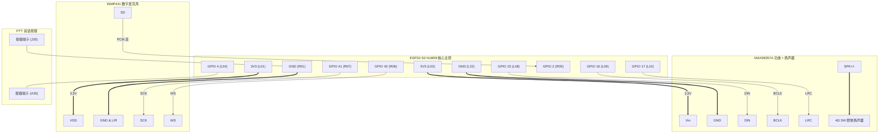

# 🍞 ESP32-S3 ESP-NOW 对讲机 —— 面包板 MVP 实物设计与装配手册

本项目利用 **ESP-NOW** 协议超低延迟（<5ms）、免配网直连的特性，使用 **ESP32-S3 + INMP441 数字麦克风 + MAX98357A 功放 + 4Ω 3W 腔体喇叭** 在 **MB-102 (830孔)** 面包板上构建对讲机最小可行性原型（MVP）。

针对标准 ESP32-S3 核心板较宽的特点，本项目采用嵌入式实战中最灵活、最高效的**“主控板独立放置 + 杜邦线飞线入板”**架构，避免破坏引脚，并赋予面包板最宽敞的布线空间。

---

## 🗺️ 系统架构与数据流图

```mermaid
flowchart TD
    subgraph NodeA["发射端 (按下 PTT 说话)"]
        MIC_A["INMP441 (I2S 数字麦克风)"] -->|I2S DMA (8kHz 16bit)| ESP_A["ESP32-S3 发射主控"]
        BTN_A["PTT 实体按键 (GPIO 4)"] -->|按下触发 TX| ESP_A
        ESP_A -->|ESP-NOW 广播音频帧 (<5ms)| RF_A["2.4GHz Wi-Fi 射频天线"]
    end

    RF_A -.->|空间无线传输| RF_B

    subgraph NodeB["接收端 (监听待机)"]
        RF_B["2.4GHz Wi-Fi 射频天线"] -->|ESP-NOW 接收中断| ESP_B["ESP32-S3 接收主控"]
        ESP_B -->|抖动缓冲 RingBuffer| DMA_B["I2S DMA 播放流"]
        DMA_B --> AMP_B["MAX98357A 功放"]
        AMP_B --> SPK_B["4Ω 3W 腔体扬声器"]
    end
```

---

## ⚡ 单一 USB 供电架构原理

在面包板阶段，**不需要任何外部升压/降压电源模块**，仅需将电脑或充电宝的 USB 线插入 ESP32-S3 的 `UART` 口：

```mermaid
flowchart LR
    USB["USB 数据线 (电脑 / 充电器 / 充电宝 5V)"] -->|插入 UART 口| DEVKIT["ESP32-S3 开发板"]
    
    DEVKIT -->|板载高精度 LDO 稳压输出 3.3V| PIN_3V3_L02["开发板 3V3 引脚 (L02)"]
    PIN_3V3_L02 -->|稳定供电 (规避防倒灌隔离)| AMP["MAX98357A 功放 (Vin)"]
    
    DEVKIT -->|板载 LDO 输出 3.3V| PIN_3V3_L01["开发板 3V3 引脚 (L01)"]
    PIN_3V3_L01 -->|安全供电 (防烧)| MIC["INMP441 麦克风 (VDD)"]
    PIN_3V3_L01 -->|核心工作| ESP_CORE["ESP32-S3 芯片内部 (3.3V)"]
```

> [!IMPORTANT]
> - **MAX98357A 功放供电 (Vin)**：实测接开发板左侧第 2 脚 **`3V3 (L02)`**。DOIT ESPS3-32 开发板在 USB 供电时，板载防倒灌肖特基二极管会将排针 `5Vin` 隔离（无电压输出）。MAX98357A 支持 2.5V~5.5V 超宽电压，在 3.3V 供电下推 4Ω 3W 腔体喇叭音量极其充沛洪亮，且逻辑电平与 ESP32-S3 完美同源；
> - **INMP441 麦克风供电 (VDD)**：必须接 **`3V3 (L01)`**，严禁误接 5V，否则会直接击穿麦克风内部 MEMS 传感器。

---

## 📐 面包板实物器件定位与行号坐标

```text
                     【MB-102 830孔 面包板实物布局总览】

         (A  B  C  D  E)          [中间凹槽]          (F  G  H  I  J)
-----------------------------------------------------------------------------------------
Row 20   [ MAX98357A 功放 7脚 ]   |          |        (空闲接线区)
 ...     [ 插在 E20 ~ E26 7个孔 ] |          |
Row 26   [ 绿色喇叭端子朝外 ]     |          |
-----------------------------------------------------------------------------------------
Row 35   (接线孔 A35) [按键左脚] ───| 跨中缝凹槽 |─── [按键右脚] (接线孔 J35)
Row 37                [按键左脚] ───|   按压区   |─── [按键右脚]
-----------------------------------------------------------------------------------------
Row 49   (空闲接线区 D/C/B/A)     |          |        (空闲接线区 G/H/I/J)
Row 50   [ SD / VDD / GND ]       | 跨中缝凹槽 |        [ SCK / WS / L/R ]
Row 51   [ 麦克风下排 3 脚(E列) ]  |  麦克风区  |        [ 麦克风上排 3 脚(F列) ]
-----------------------------------------------------------------------------------------
```

---

## 📋 杜邦线实物引脚精准对照表 (DOIT ESPS3-32 N16R8)

开发板放置在面包板旁，以**黑色天线朝上、两个 Type-C 朝下**为正向基准：

### 1. 麦克风模块 (圆形 INMP441，跨插在 Row 49 ~ 51)
| 麦克风引脚 | 所在面包板行号/孔位 | 杜邦线连接目标 (ESP32-S3 实物位置) | 作用说明 |
| :--- | :--- | :--- | :--- |
| **`SCK`** | Row 49 (F列插脚，线插 G49~J49) | **右侧第 7 脚：`GPIO 41`** | I2S 位时钟 |
| **`WS`** | Row 50 (F列插脚，线插 G50~J50) | **右侧第 6 脚：`GPIO 42`** | I2S 左右声道时钟 |
| **`L/R`** | Row 51 (F列插脚，线插 G51~J51) | **右侧第 1 脚：`GND`** | 接地选定左声道 |
| **`SD`** | Row 49 (E列插脚，线插 D49~A49) | **右侧第 5 脚：`GPIO 2`** | 麦克风采集数字音频流 |
| **`VDD`** | Row 50 (E列插脚，线插 D50~A50) | **左侧第 1 脚：`3V3`** | ⚡ 麦克风 3.3V 供电（严禁接 5V） |
| **`GND`** | Row 51 (E列插脚，线插 D51~A51) | **右侧第 1 脚：`GND`** | 麦克风地线 |

> 💡 **布局巧思**：开发板右侧排针的第 5、6、7 脚正好是连续的 **`2`、`42`、`41`**，三根杜邦线顺着排下来插，非常工整。

---

### 2. 功放模块 (MAX98357A，插在 E 列 Row 20 ~ 26)
| 功放引脚 | 所在面包板孔位 | 杜邦线连接目标 (ESP32-S3 实物位置) | 作用说明 |
| :--- | :--- | :--- | :--- |
| **`Vin`** | 插 `E20`，线插 `D20` 或 `A20` | **左侧第 2 脚：`3V3`**（推荐，USB直供稳定） | ⚡ 功放供电 (2.5V~5.5V宽压) |
| **`GND`** | 插 `E21`，线插 `D21` 或 `A21` | **左侧第 22 脚：`GND`** | 功放接地 |
| **`SD`** | 插 `E22` | **悬空 (不接线)** 或接 `Vin` | 默认开启输出 (若无声可连 Vin 唤醒) |
| **`GAIN`** | 插 `E23` | **悬空 (不接线)** | 默认 9dB 增益 |
| **`DIN`** | 插 `E24`，线插 `D24` 或 `A24` | **左侧第 8 脚：`GPIO 15`** | 喇叭数字音频数据流 |
| **`BCLK`**| 插 `E25`，线插 `D25` 或 `A25` | **左侧第 9 脚：`GPIO 16`** | 喇叭位时钟 |
| **`LRC`** | 插 `E26`，线插 `D26` 或 `A26` | **左侧第 10 脚：`GPIO 17`** | 喇叭左右声道时钟 |
| **绿色端子**| 螺丝压线孔 | **拧紧 4Ω 3W 腔体小喇叭红黑线** | 扬声器输出（不分正负极） |

> 💡 **布局巧思**：功放所有的引脚全部连接在开发板的**左侧排针**，`15`、`16`、`17` 是紧挨着的三个引脚，`3V3` 和 `GND` 连接便捷，实测 3.3V 供电声音洪亮清脆且无需担心 5V 倒灌问题。

---

### 3. PTT 说话按键 (4脚轻触按键，跨插在 Row 35 与 Row 37)
| 按键引脚 | 所在面包板孔位 | 杜邦线连接目标 (ESP32-S3 实物位置) | 作用说明 |
| :--- | :--- | :--- | :--- |
| **左脚** | 插 `E35` 与 `E37`，线插 **`A35`** | **左侧第 4 脚：`GPIO 4`** | ESP32 内部弱上拉，按键信号检测 |
| **右脚** | 插 `F35` 与 `F37`，线插 **`J35`** | **右侧第 1 脚：`GND`**（或任意 GND） | 按下按键时将 GPIO4 拉低到 0V |

---

## ⚡ 电气拓扑图



---

## 🔍 通电前“防炸机与防杂音”最终体检

1. **[关键核心] 麦克风供电**：再次确认 INMP441 的 `VDD` 连在开发板左上角的 **`3V3`**，绝对不是 5Vin！
2. **[关键核心] 喇叭接线牢固度**：轻拽绿色端子里的两根喇叭线，确认螺丝已咬紧，两根裸铜丝互不碰触短路。
3. **[接口核对] USB 数据线**：插在开发板右侧底部的 **`UART`** 口（用于识别串口并烧录监控）。
