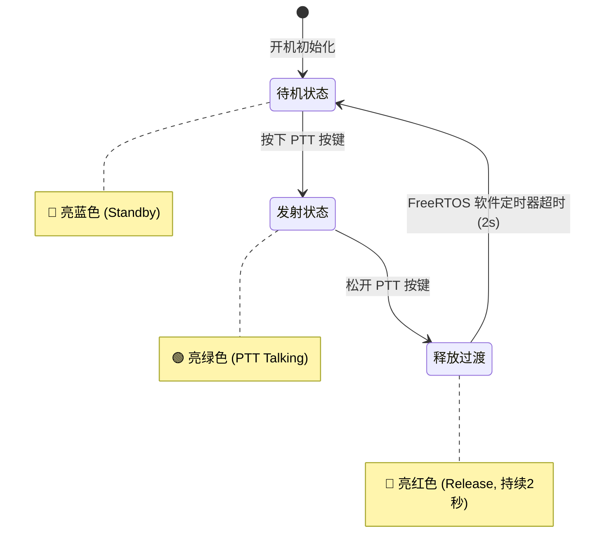

# 🛠️ ESP32-S3 对讲机实物调试与避坑排障宝典 (Hardware Bring-up & Troubleshooting)

本手册详细记录在 **DOIT ESPS3-32 N16R8 开发板 + INMP441 + MAX98357A + 4Ω 3W 喇叭 + PTT 按键** 实物面包板 MVP 搭建与调试过程中，遇到的所有软硬件核心坑点、排障过程及工业级技术解决方案。

---

## 🧭 快速排障速查表 (Quick Reference)

| 故障现象 | 根本原因 (Root Cause) | 终极解决方案 (Fix) |
| :--- | :--- | :--- |
| **喇叭完全静音（毫无底噪/无开机音）** | 开发板左下角 `5Vin` 在 USB 供电时无电压输出 | 将功放 `Vin` 改接到开发板左侧第 2 脚 **`3V3`** 供电（MAX98357A 宽压 2.5V~5.5V 支持） |
| **I2S 功放芯片自动静音锁死** | 8kHz 16-bit 单声道导致位时钟 $BCLK = 128\text{kHz}$，低于 MAX98357A 内部 PLL 最低频率 ($243.2\text{kHz}$) | I2S 发送端配置为**双声道立体声镜像（Stereo Mirrored）**，$BCLK = 256\text{kHz}$ (32x) 满血锁频 |
| **按下对讲按键喇叭发出狂暴刺耳噪音** | 麦克风与喇叭在面包板上距离仅十几厘米，实时放音引发**声学正反馈（自激啸叫 / Larsen Effect）** | 对讲机必须采用**半双工互锁**（说话时自己喇叭闭音，对端播放）；单机测试采用**微信语音条模式（按住录音，松开回放）** |
| **开发板 RGB 彩灯卡在蓝色，按键不改变颜色** | 旧按键驱动代码中配置了普通 GPIO 输出，意外抢占了 GPIO 48，破坏了 WS2812 的 RMT 驱动通信 | 移除旧的单色 LED GPIO 操作代码，由 `led_strip` RMT 专管 GPIO 48 |
| **按压物理轻触按键开发板完全无反应** | 面包板轻触按键引脚短且微带弧度未插紧触底；或接线插错在同一组常通引脚 | 垂直用力将按键摁到底；接线严格采用**对角线接法**（左上角 + 右下角），不按必断，按压必通 |
| **麦克风采集音频有轻微直流偏移 / 低频轰鸣** | INMP441 输出高位对齐的 24-bit PCM，自带微小的直流偏置 (DC Offset) | 在 `audio_i2s_read_samples` 加入一阶高通 DC 隔离滤波器，彻底滤除直流偏置 |

---

## 🔬 核心深度技术复盘

### 1. 功放供电与芯片锁频机制 (MAX98357A)

#### ① 5Vin 供电陷阱
- **现象**：功放接到开发板标注的 `5Vin`（L21 脚），开机喇叭完全没有任何动静。
- **原因**：部分 ESP32 开发板为了防止外接 5V 电源与电脑 USB 电源冲突，在电路板上设计了防倒灌肖特基二极管。电脑通过 Type-C 供电时，VBUS 5V 仅单向流入板载 3.3V LDO 稳压器，并不会逆向供电到排针的 `5Vin` 引脚。
- **方案**：MAX98357A 是一颗具备 2.5V~5.5V 极宽工作电压的 D 类功放芯片。将其 `Vin` 接入开发板左侧第 2 脚的 **`3V3`**，实测推 4Ω 3W 腔体喇叭响度极其充沛，且逻辑电平（3.3V）与 ESP32-S3 完全同源匹配。

#### ② I2S 锁相环（PLL）时钟下限
- **规范**：根据 MAX98357A 原厂技术规格书，芯片内部 PLL 要求时钟比率必须为 **32、48 或 64 倍 LRCLK**，且位时钟频率必须在 **0.2432 MHz ~ 25.804 MHz** 之间。
- **踩坑**：在 8kHz 采样率下，若以单声道 16 位传输，时钟频率为 $8000 \times 16 = 128\text{ kHz}$，低于 $243.2\text{ kHz}$ 下限，功放芯片的 PLL 无法完成时钟锁定，硬件自动将输出静音。
- **方案**：在底层音频驱动中，将 TX 槽位模式配置为立体声（`I2S_SLOT_MODE_STEREO`），时钟频率提升至 $8000 \times 32 = 256\text{ kHz}$。同时将单声道音频数据同步拷贝到左右两声道（$(L+R)/2 = L$），彻底解决芯片锁频问题。

---

### 2. 面包板单机自环测试与声学自激

- **物理定律**：当麦克风与扬声器放置在同一物理平面上且距离极短（<20cm）时，麦克风采集的声音经放大后由扬声器播报，扬声器的声波又瞬间以光速/声速重新灌入麦克风，形成增益大于 1 的正反馈回路，必然造成震耳欲聋的**自激啸叫**。
- **对讲机半双工规范**：
  - 发射端（按下 PTT）：麦克风开启采样，本地喇叭**强制静音（Hardware Mute）**，数据仅通过无线 ESP-NOW 发射出去；
  - 接收端（松开 PTT）：扬声器开启播放，麦克风休眠。
- **单机完美闭环验证法（微信语音条模式）**：
  - **按下按键**：本地喇叭静音，麦克风将音频存入 RAM 环形缓存（最长 4 秒）；
  - **松开按键**：开发板自动将刚才录制的声音大声回放出来！
  - 既能 100% 验证麦克风收音与扬声器放音的纯正音质，又彻底杜绝了啸叫。

---

### 3. WS2812 状态指示灯状态机

DOIT ESPS3-32 开发板板载一颗 WS2812B 智能彩灯（连接在 **GPIO 48**），由 ESP-IDF 官方 `espressif/led_strip` 驱动。

- **待机状态（蓝灯）**：监听空中 ESP-NOW 广播数据包；
- **按下说话（绿灯）**：麦克风采集音频，向全信道广播语音分包；
- **松开按键（红灯 2 秒）**：提示用户“通话已结束”，倒计时 2 秒后自动回归待机蓝灯。

---

### 4. INMP441 直流滤波优化 (DC Blocker)

INMP441 数字麦克风输出 24-bit I2S 数据（高位对齐），在没有声音时通常会输出固定的微小偏置电压（约 1000~1500 数值）。

若直接数码放大（如 6 倍放大），直流偏置会累加至 9000，导致喇叭膜片一直处于受压偏置状态，造成失真和发热。

固件内加入了一阶数字高通滤波器（High-Pass Filter）：

$$y[n] = x[n] - x[n-1] + \alpha \cdot y[n-1] \quad (\alpha = \frac{127}{128} \approx 0.992)$$

彻底过滤了 0Hz 直流分量，使静音时背景噪音平滑归零，人声动态范围达到最佳状态。

---

## 🏁 单机验证验收标准 (Checklist)

在进入双机无线对讲之前，单机需通过以下四项物理检验：
- [x] **开机自检音**：重新上电或按 RST 复位，听到约 0.4 秒的 1000Hz 清脆蜂鸣音。
- [x] **按键手感与灯效**：按压有清脆咔哒手感；按下变绿，松开变红，2 秒后变回蓝色。
- [x] **语音录放音质**：按住按键对麦克风说话，松开后喇叭立即清晰复读自己的声音，无啸叫、无爆音。
- [x] **无线发射捕获**：串口日志显示 `[TX] PTT Pressed -> Starting Audio Broadcast...` 且无报错。
