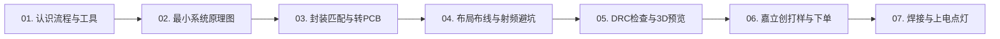

# 📚 ESP32 PCB 零基础从入门到投产实战教程

欢迎开启硬件设计之旅！无论你之前是否接触过电路，跟着本教程一步一步做，你不仅能完全理解原理，还能亲手画出并拿到属于自己的第一块 ESP32 开发板。

---

## 🗺️ 零基础通关路线图 (Roadmap)

---

## 📖 教程目录导航

| 章节 | 内容主题 | 核心技能点 | 状态 |
| :--- | :--- | :--- | :---: |
| [**01. 准备篇：硬件设计全流程与工具上手**](01-quick-start-and-workflow.md) | 嘉立创EDA专业版、立创商城基础、全流程认知 | 安装配置、元器件库搜索、工程创建 | 🟢 已就绪 |
| [**02. 原理图篇：ESP32 最小系统五大模块**](02-esp32-schematic-guide.md) | Type-C、LDO电源、自动下载、复位/BOOT、模组 | 模块化电路设计、LCSC 选型标准 | 🟢 已就绪 |
| [**03. 封装篇：原理图转 PCB 与封装检查**](03-footprint-and-netlist.md) | 原理图符号 vs 物理封装、网表传递、飞线理解 | 封装绑定、3D 库关联、原理图转 PCB | 🟢 已就绪 |
| [**04. PCB 篇：布局技巧、布线规范与天线禁铜**](04-pcb-layout-and-routing.md) | 元器件摆放、线宽计算、地平面铺铜、RF 区域处理 | 45°走线、去耦电容就近、天线避空 | 🟢 已就绪 |
| [**05. 检查篇：DRC 规则检查与 3D 渲染**](05-drc-and-3d-inspection.md) | 嘉立创工艺规则、DRC 错误消除、3D 结构干涉 | 工艺线距设置、丝印调整、3D 预览 | 🟢 已就绪 |
| [**06. 投产篇：免费打样与 SMT 贴片下单**](06-gerber-and-ordering.md) | 导出 Gerber、BOM、坐标文件，嘉立创下单 | 白嫖打样券、SMT 基础库省钱技巧 | 🟢 已就绪 |
| [**07. 验证篇：硬件 Bring-up 与点灯测试**](07-bringup-and-first-blink.md) | 万用表防短路测试、串口烧录、GPIO 点灯 | 冒烟测试、供电轨测量、固件验证 | 🟢 已就绪 |

---

## 💡 新手必知的两句话

1. **“先用模组，不要直接裸片画芯片”**：ESP32 官方模组（如 ESP32-WROOM-32E / ESP32-C3-WROOM）内部已经集成调好晶振、Flash 和天线阻抗匹配，初学者选用模组可以将成功率直接提升到 100%。
2. **“原理图是骨骼，PCB 是血肉”**：原理图关注“电气逻辑连通”，PCB 关注“物理走线与空间布局”。只要原理图逻辑正确，PCB 再根据规则走线，就绝不会翻车。
